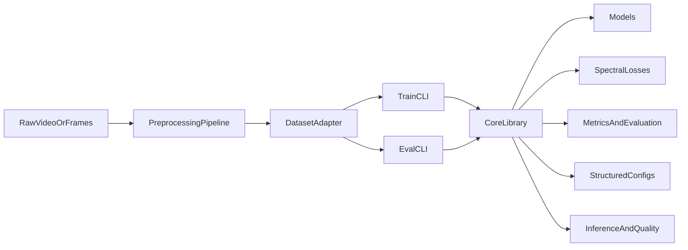

# SiNC-rPPG Modernization Plan

## Recommendation

The repository is currently best suited for a phased modernization effort. The most practical path is to first reshape it into a reusable research platform and then introduce an internal package installation workflow for collaborators.

The most practical outcomes, in order, are:

- **Immediate priority:** better README/onboarding, reproducibility, examples, cleaner configuration, and modular registries for datasets, models, and losses.
- **Core platform goal:** broader applicability across datasets and scenarios through clearer separation of preprocessing, data access, experiment configuration, and training/evaluation.
- **Operational milestone:** an internal package installation path that gives collaborators a consistent way to install and run the codebase.
- **Longer-horizon improvement:** scaling improvements for larger experiments and broader collaboration.

## Why This Repo Is A Good Foundation

The core research idea is already clean and reusable: train a video model to predict a pulse waveform, then optimize the spectrum of that waveform with reusable loss terms in [src/utils/losses.py](src/utils/losses.py). The main limitations are around project structure and ergonomics rather than the core method.

Most important constraints today:

- Imports and execution assume running from `src`, as seen in [src/train.py](src/train.py) and [src/test.py](src/test.py).
- Dataset selection is hard-coded and incomplete in [src/datasets/utils.py](src/datasets/utils.py).
- Data loading depends on repo-relative CSV paths in [src/datasets/PURE.py](src/datasets/PURE.py).
- The public surface is effectively one argparse namespace in [src/args.py](src/args.py), which is fine for a paper but weak for reuse.

## Recommended Phases

### Phase 1: Make It Modular

Turn the repo into a reusable research codebase rather than a one-off experiment tree.

- Introduce registries for datasets, models, and losses instead of `if/elif` selectors in [src/datasets/utils.py](src/datasets/utils.py) and [src/utils/model_selector.py](src/utils/model_selector.py).
- Separate library code from CLI entrypoints: keep train/eval scripts thin and move reusable logic behind functions/classes.
- Replace cwd-sensitive paths with explicit `data_root`, `metadata_path`, and `output_dir` configuration.
- Split configuration into structured sections for dataset, model, optimization, and evaluation rather than one flat argparse namespace.
- Define a stable dataset contract so PURE, UBFC, and future datasets can share the same interfaces.

### Phase 2: Make It Research-Ready

Extend the platform for broader rPPG research instead of only general cleanup.

- Add support for dataset-specific preprocessing choices, since different video sources may need different crop regions, occlusion handling, frame rates, and quality filters than PURE.
- Track uncertainty and signal-quality metrics alongside waveform/HR predictions so weak predictions can be flagged rather than trusted.
- Build evaluation around cross-domain generalization, with explicit train/val/test provenance across datasets and collection settings.
- Add experiment manifests so every run records preprocessing version, split logic, loss recipe, and checkpoint lineage.
- Consider multiple inference modes: waveform prediction, HR prediction, and confidence/quality prediction.

### Phase 3: Make It Scale

Improve throughput and maintainability for larger research efforts.

- Add better device/config support than hard-coded `cuda:0` in [src/train.py](src/train.py) and [src/test.py](src/test.py).
- Improve data loading and validation throughput; current validation is intentionally simple but not optimized for larger studies.
- Add automated tests for registries, transforms, dataset contracts, and loss computations.
- Add CI for basic lint/test/import checks so refactors do not silently break training.
- Introduce experiment tracking and artifact organization suitable for many runs and collaborators.

### Phase 4: Install Internally As A Package

Once the codebase is sufficiently modular, make it straightforward for collaborators to install, run, and reuse the project in a consistent way across machines and contributors.

- Add a proper package layout and `pyproject.toml` suitable for editable installs.
- Support `pip install -e .` for internal and lab use across machines and contributors.
- Expose stable internal entry points for training, evaluation, and inference.
- Keep research scripts and dataset-specific preprocessing as thin wrappers around package code.
- Use the internal package boundary to reinforce separation between library logic and experiment scripts.

### Phase 5: Make It Usable

Focus on documentation, setup, and truthful repository behavior.

- Rewrite the top-level README with a clear quickstart, environment assumptions, preprocessing flow, train/eval examples, and output layout.
- Add a minimal smoke-test workflow using the existing `--debug` path in [src/args.py](src/args.py).
- Align docs with reality: document which datasets are truly supported now vs planned.
- Use [scripts/run_experiments.py](scripts/run_experiments.py) as the portable train/test entry point (former `train_PURE.sh` / `test_PURE.sh` shell scripts removed).
- Add repo metadata that makes collaboration easier: `LICENSE`, contribution notes, and environment/version guidance.

## Best-Fit End State

For this project and research context, the best end state is likely:

- a **well-documented research framework** for rPPG experiments,
- with **clear dataset adapters** for multiple public and private datasets,
- and with an **internal editable install** as the standard operational mode for collaborators.

That gives you practical value sooner by improving research velocity, collaboration, and maintainability without requiring the repository to become a public-facing software product.

## Additional Improvements Worth Pursuing

Beyond the options you listed, the most valuable enhancements for a broader rPPG research platform are:

- **Dataset abstraction:** support multiple metadata schemas and split strategies without rewriting loader internals.
- **Preprocessing abstraction:** separate face/ROI detection from clip assembly so different detectors or ROI policies can be swapped in.
- **Signal-quality gating:** model or compute confidence/quality so unusable clips are rejected automatically.
- **Domain adaptation experiments:** compare training across datasets, fine-tuning strategies, and hybrid losses.
- **Reproducibility tooling:** fixed seeds, run manifests, config snapshots, and standardized result summaries.
- **Operational workflow support:** inference pipelines that can operate on longer videos, batch jobs, or streaming windows.
- **Privacy-aware deployment path:** clear separation between raw video handling, derived crops, and saved artifacts.

## Suggested First Slice

A strong first milestone would be:

- documentation refresh,
- path/config cleanup,
- dataset/model registries,
- proper support for more than one dataset,
- and a thin library/CLI split.

That milestone would materially improve research velocity and make later scaling and internal packaging much easier.

## Architecture Direction

## Key Files To Target First

- [README.md](README.md)
- [src/args.py](src/args.py)
- [src/train.py](src/train.py)
- [src/test.py](src/test.py)
- [src/datasets/utils.py](src/datasets/utils.py)
- [src/datasets/PURE.py](src/datasets/PURE.py)
- [src/utils/model_selector.py](src/utils/model_selector.py)
- [src/preprocessing/utils.py](src/preprocessing/utils.py)

